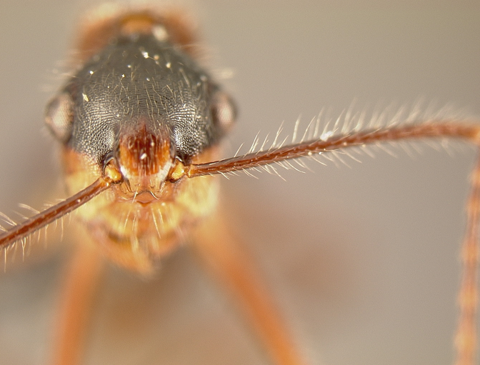
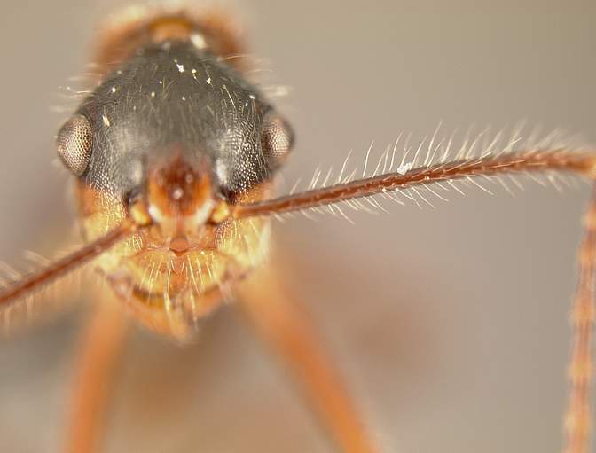
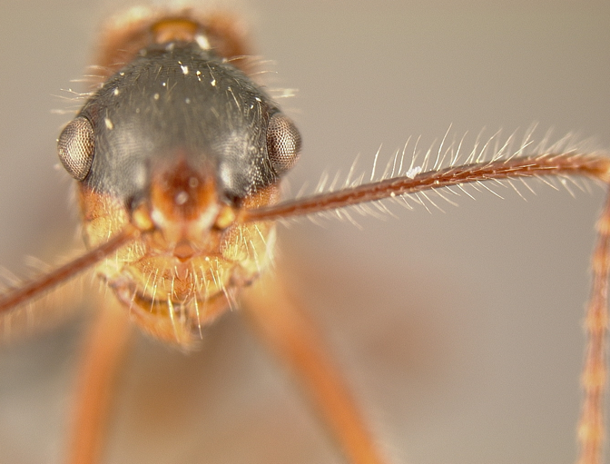
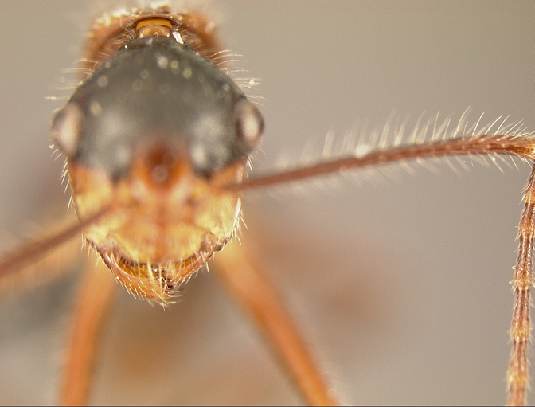
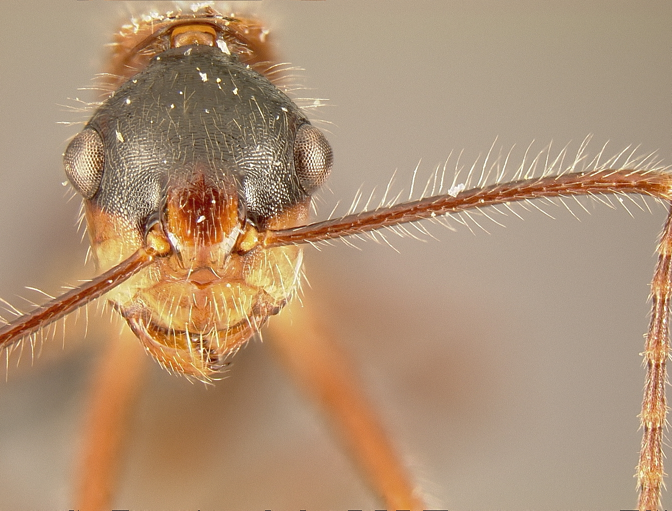
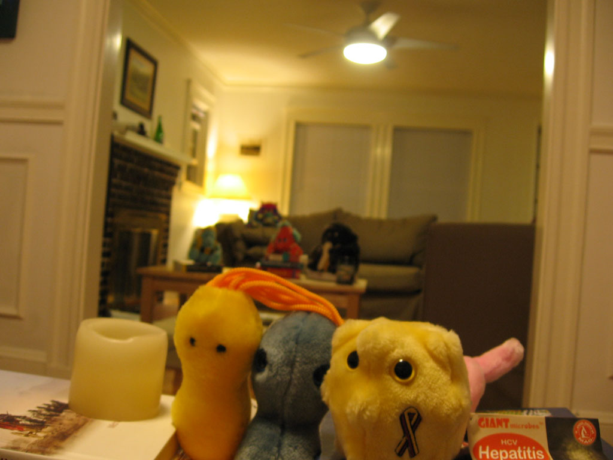
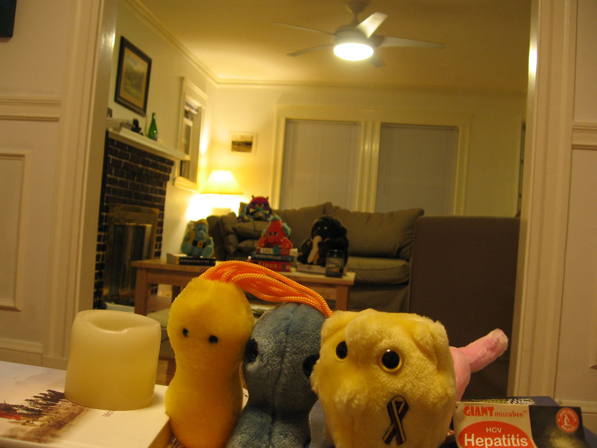
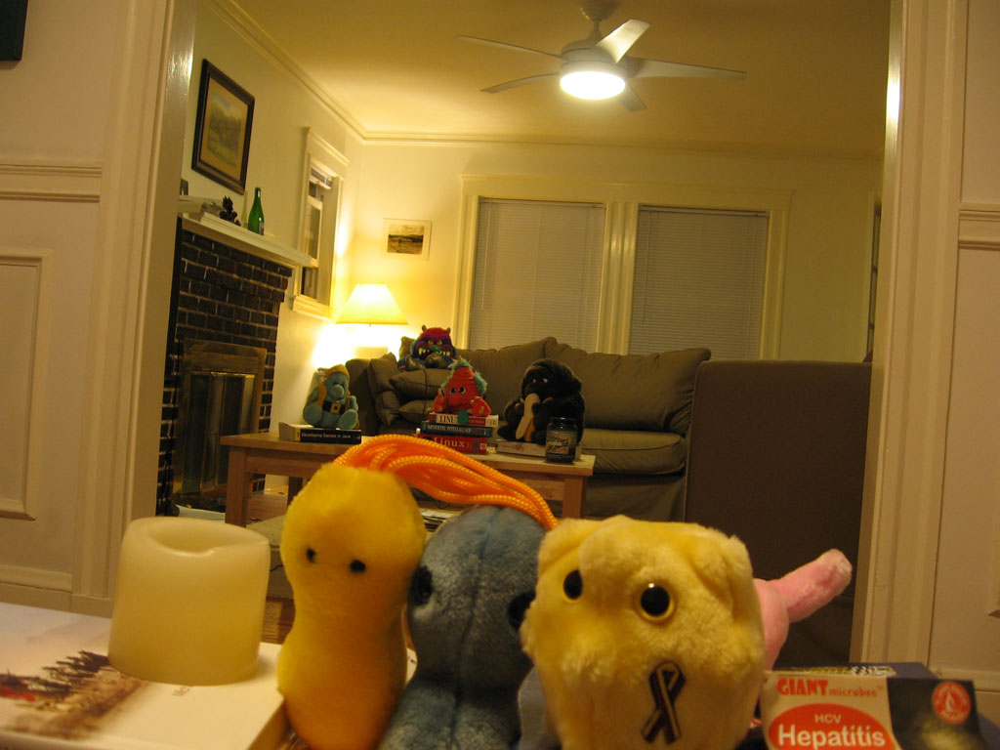
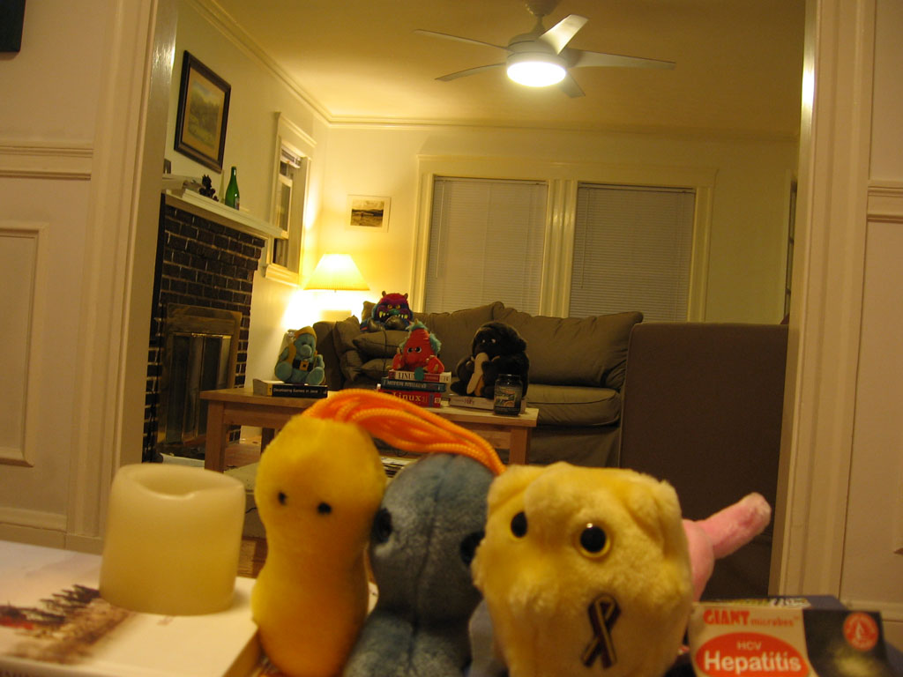
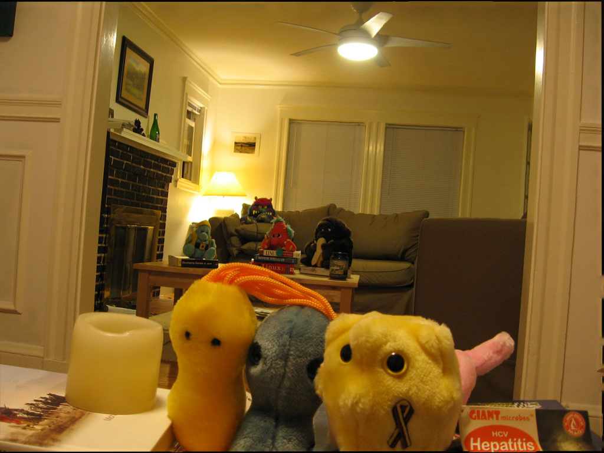

# Demonstration

Demonstration of the results of the algorithm for 
two set of images.

## Bug

### Input

### Best output (t=4)

## Room

The pictures are slightly misaligned so a realignment step has to be performed.
Source of the pictures: Nathan Ricci's [website](http://www.eecs.tufts.edu/~nricci01/comp_photo/assign2.html)
of for a similar assignment.

### Input

### Output (any value of t gives a similar output)

